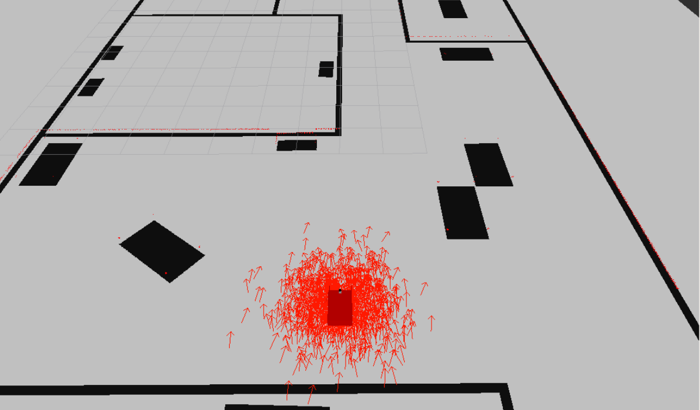
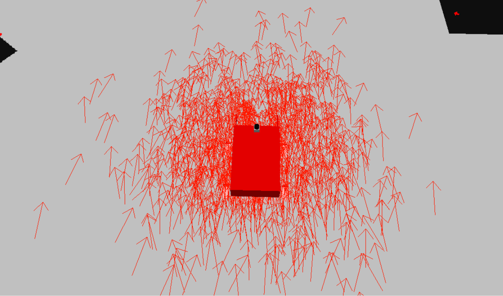
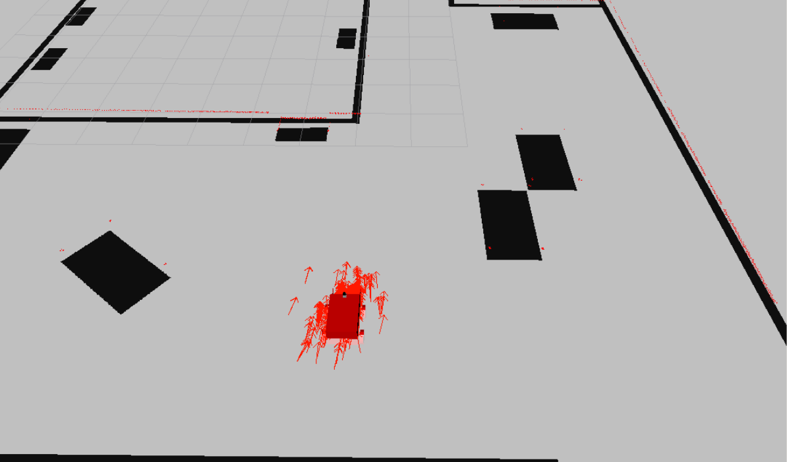
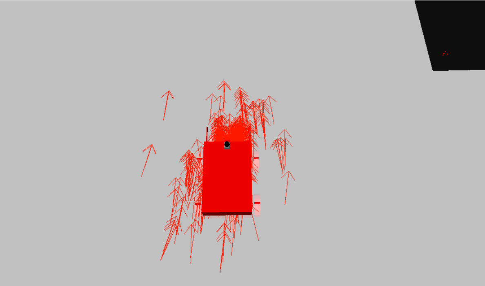
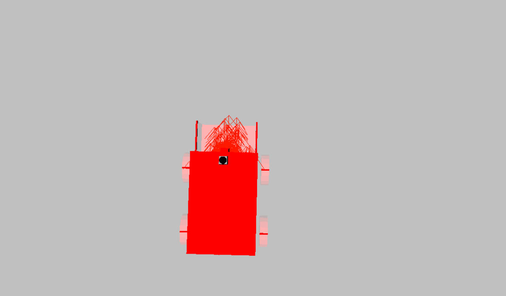

# RoboND-Where-Am-I-Project
Third project of the Robotics Course of Udacity

## Prerequisites 
* make >= 4.1
* gcc/g++ >= 5.4
* Gazebo >= 7.0  
* ROS Kinetic  
* ROS navigation package  
`sudo apt-get install ros-kinetic-navigation`
* ROS map_server package  
`sudo apt-get install ros-kinetic-map-server`
* ROS move_base package  
`sudo apt-get install ros-kinetic-move-base`
* ROS amcl package  
`sudo apt-get install ros-kinetic-amcl`

## Edit the .bashrc file
Insert the line `source /opt/ros/melodic/setup.bash` in .bashrc  
Restart the terminal

## Clone the repo in your workspace
`$ git clone https://github.com/bruno-szdl/RoboCppND-Where-Am-I-Project.git`

## Build the project
In the project folder  
`$ cd catkin_ws`  
`$ catkin_make`

## Launch the world
`$ source devel/setup.bash`  
`$ roslaunch my_robot world.launch`

## Launch amcl node
Open a new terminal  
`$ source devel/setup.bash`  
`$ roslaunch my_robot amcl.launch`

## RViz
Click the “Add” button and add RobotModel  
Add Map and select first topic/map  
Add PoseArray and select topic/particlecloud

## Run the teleop node
Open a new terminal
`$ source devel/setup.bash`  
`$ rosrun teleop_twist_keyboard teleop_twist_keyboard.py`
Control de robot using the keyboard

## End result
### Initial position

### Intermediate position

### Final position

